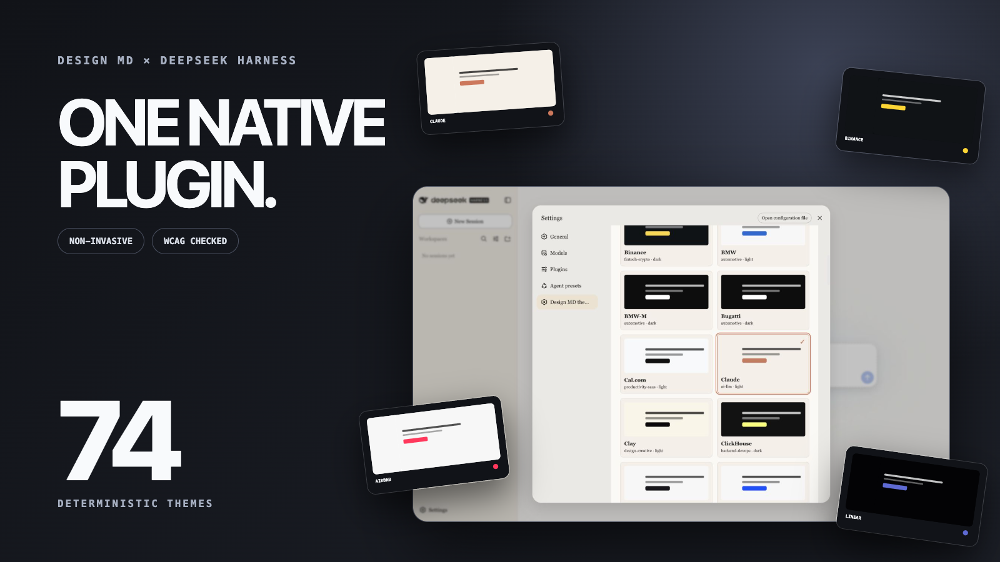
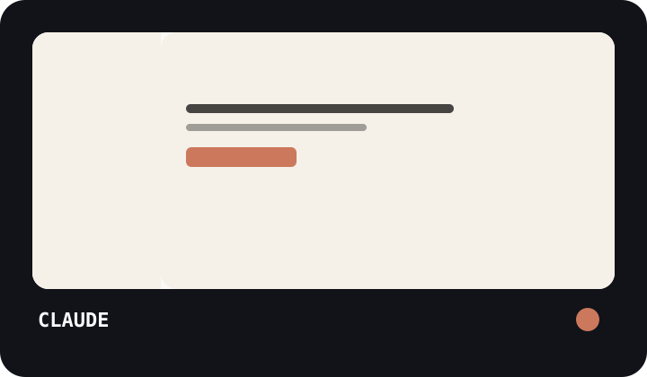
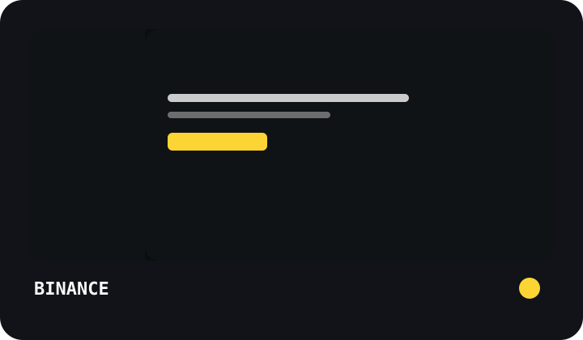
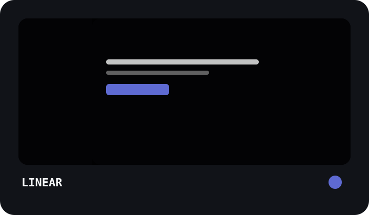
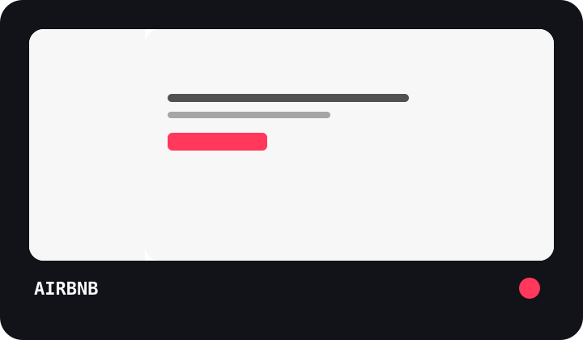
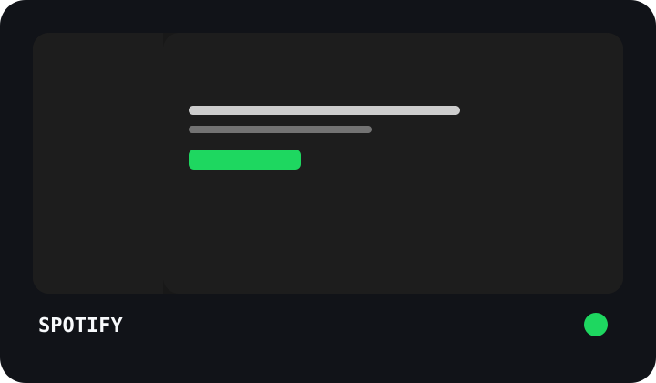
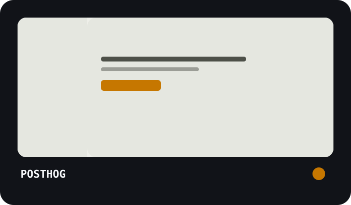
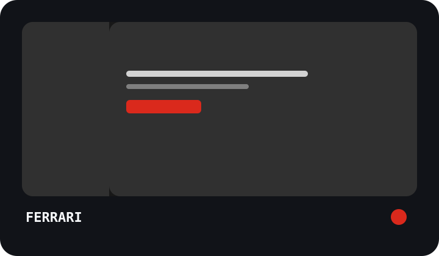
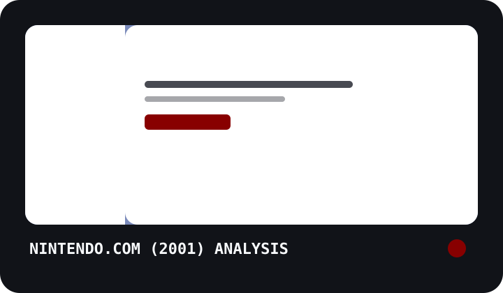
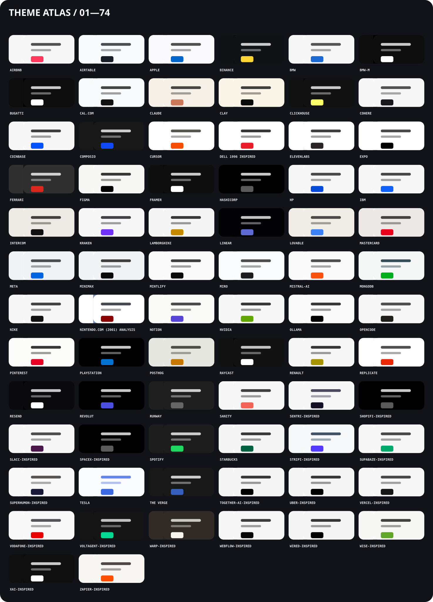

# deepseek-harness-design-md-themes

Chinese version: [README.zh.md](README.zh.md)



> 74 deterministic themes generated from `awesome-design-md`, installed through the native DeepSeek Harness plugin mechanism—without patching Harness source code.

## Quick start

```bash
dsh plugin --profile web add deepseek-harness-design-md-themes
dsh web
```

Open **Settings → Design MD themes**, choose a card, and the selection remains active after reload.

## Why this plugin

- **Native integration** — registers themes through Theme Service and contributes one `settings.section`.
- **Deterministic catalog** — 74 themes generated from pinned source commit `8147538b4226ae41e2487a9179e3bcc1f68e8554`.
- **Owned persistence** — writes only the `deepseek-harness-design-md-themes` settings namespace.

## Eight signature themes

<p align="center">
  
  
  
  
  
  
  
  
</p>

## All 74 themes



See [the catalog](docs/themes.md) for theme IDs, categories, source paths, and contrast adjustments.

## Non-invasive by design

The plugin uses the documented `dsh.client` injection list, Cordis patch contribution, Theme Service, Settings Scope, Locale Service, and UI Slots. It does not patch Harness components, query internal DOM, override unrelated global CSS, or replace Harness files.

## Compatibility and maintenance

- DeepSeek Harness `0.1.1-rc.2`
- Node.js `^22.19.0 || >=24.0.0` for generation and packaging
- React `18.2+` or `19.x`, supplied by Harness

Installation: [docs/installation.md](docs/installation.md) · Maintenance: [docs/maintenance.md](docs/maintenance.md) · Attribution: [THIRD_PARTY_NOTICES.md](THIRD_PARTY_NOTICES.md)
