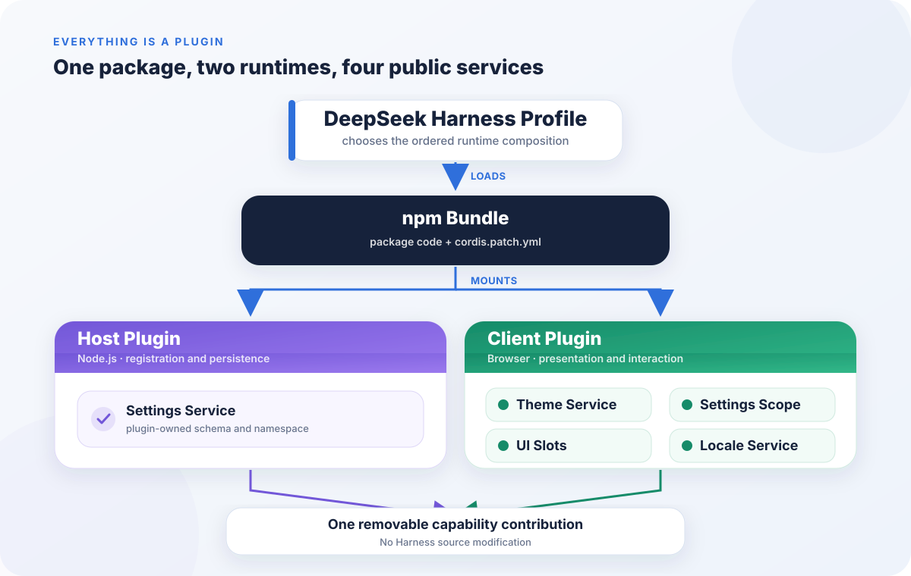

# 我给 DeepSeek Harness 装了 74 个主题，也终于看懂了 Everything is a Plugin

能不能在不修改 DeepSeek Harness 一行源码的前提下，给它装进 74 套完全不同的界面主题？

这是我开发 `deepseek-harness-design-md-themes` 时给自己定下的硬约束。

不能复制一份 Harness 出来长期维护，不能替换它的组件文件，也不能趁页面加载后寻找某个 DOM 节点，再偷偷塞进去一段全局 CSS。插件应该像一个真正的系统成员那样进入 Harness，也应该能在被卸载时干净地离开。

最终做出来的是这个。


这 74 个主题来自 [VoltAgent 的 awesome-design-md](https://github.com/VoltAgent/awesome-design-md)，项目固定了一个确定的上游提交，把每份 `DESIGN.md` 转换成 Harness 能理解的主题 token。用户安装插件后，会在设置页面看到一个新的主题画廊，可以搜索、筛选、选择并保存自己的主题。

表面上看，这只是一次界面定制。

但真正值得追问的，并不是怎样把 Claude、Linear、Binance 或 Ferrari 的色彩放进 Harness，而是为什么整个过程不需要向 Harness 申请一个专用主题入口，也不需要修改它的启动代码。插件只声明自己依赖哪些能力，然后把新的能力注册进去。

这正好给了我们一个很具体的入口，去理解 DeepSeek Harness 那句很醒目的架构宣言。

Everything is a Plugin。

## 它不是一个主程序带着一圈外挂

我们平时说插件系统，脑子里很容易出现一种结构。中间是一个功能完整、不可替换的主程序，周围预留了几个扩展点。插件能增加菜单、接收事件、调整外观，但不能动中央那台机器。

DeepSeek Harness 的想法更激进一些。

按照它的[官方架构文档](https://github.com/deepseek-ai/deepseek-harness/blob/master/docs/architecture.md)，底层的 Cordis 运行时把模型适配器、工具注册表、会话日志，甚至 Agent Loop 本身都组织成插件。官方对这种结构的描述很直接，系统里不存在一个等待你去修补的特权核心。一次运行中的 `dsh`，其实是一棵在启动时由配置组合出来的插件树。

所以，Everything is a Plugin 不是说产品支持很多插件，也不是说所有代码都要打包成 npm 包。它表达的是一种系统组织方式。

能力不是先被焊死在主程序里，再挑几处开放接口。能力从一开始就由插件提供，由服务契约连接，由配置决定如何组合。

这种结构放在 Agent 产品里尤其有意思。

一个 Agent 看起来像聊天框，背后却不是单一功能。它要选择模型，组装 System Prompt，暴露工具，读写工作区，执行命令，处理用户授权，记录会话，还要把运行轨迹呈现在不同界面上。任何一项能力变化，都可能改变整个 Agent 的行为。

更麻烦的是，不同场景需要的组合完全不同。

一个面向开发者的 Agent 可能需要代码运行时、Git 和严格的写入审批。一个只负责信息检索的 Agent 不需要命令执行，却可能更在意引用、浏览器和结果留存。自动化任务不需要聊天界面，但需要调度、凭据和失败通知。它们可以共享大量能力，却不应该被迫启动同一个巨大应用，再靠几十个开关把无关功能关掉。

如果这些能力都埋在主程序里，产品每增加一种运行形态，中央代码就要理解更多分支。时间久了，所谓灵活配置往往变成一组互相牵制的布尔值。一个开关看起来只控制界面，背后却可能碰到会话、权限和工具初始化。

插件图提供了另一种表达方式。一个运行形态不是「主程序加参数」，而是一组明确的能力节点。节点通过 Service 发生关系，通过 `inject` 形成依赖边，通过生命周期决定何时出现和离开。Profile 则把这张图固化成一次可启动的产品组合。

从产品视角看，这张图甚至可以当作运行中的功能清单。你不仅知道系统有什么，还知道每项能力由谁提供、依赖什么、拿掉之后谁会受到影响。对需要频繁替换模型、工具和执行环境的 Agent 来说，这种可解释的组合关系，比单纯拥有一个插件市场更重要。

这里有几个词需要先认识，但不用被它们吓到。

Plugin 是能力的提供者或使用者。Context 可以理解成当前运行环境里的公共能力目录。Service 是目录中一个有稳定名字的能力，例如 `tools`、`llm`、`settings` 或 `theme`。`inject` 则是一份依赖声明，告诉 Cordis 这个插件需要哪些服务。

一个最小插件可以短到这样。

```ts
// 精简示意
export const name = 'my-plugin'
export const inject = ['tools']

export function apply(ctx) {
  ctx.tools.register(/* capability */)
}
```

不懂 TypeScript 也没关系。上面真正重要的只有三件事。

插件说自己需要 `tools`。Cordis 等到这个服务可用后才运行 `apply`。插件随后通过 `ctx.tools` 注册自己的贡献。加载顺序不再靠开发者手工写一长串启动脚本，而是由服务依赖自然形成。

[Cordis Primer](https://github.com/deepseek-ai/deepseek-harness/blob/master/docs/cordis-primer.md) 还强调了另一个很关键的设计，注册是可逆的 Effect。插件注册工具、事件监听器、主题或其他资源时，这些贡献都属于插件自己的生命周期。插件卸载，对应的注册也应随之撤销。对于需要显式清理的资源，开发者可以用 `ctx.effect()` 返回一个 disposer。

这种可逆性很重要。

如果一个功能只能安装，不能完整卸载，它更像一次代码改造，而不是一个真正可组合的插件。



## 74 个主题怎样进入这张能力网络

回到主题插件。

它并没有直接操作 Harness 页面，而是和四个已经存在的公开服务合作。

第一条关系在 Host，也就是运行于 Node.js 的宿主侧。插件向 Settings Service 注册一个只属于自己的设置命名空间 `deepseek-harness-design-md-themes`，其中保存用户选择的主题 ID。

[仓库里的 Host 实现](https://github.com/yonglun/deepseek-harness-themes/blob/d0ac8e4/src/host/settings.ts)可以压缩成下面这个核心形状。

```ts
// 基于 src/host/settings.ts 的精简示意
export const inject = ['settings']

export function apply(ctx) {
  ctx.inject(inject, settingsCtx => {
    settingsCtx.settings.register(namespace, themePreferenceSchema)
  })
}
```

这段代码没有决定设置应该写进哪个具体文件，也没有自行实现一套数据库。它只是声明需要 `settings`，然后登记自己的 schema 和命名空间。存储由当前 Profile 里的设置服务负责，插件只管理自己拥有的那一小块数据。

另外三条关系发生在浏览器里的 Client。

[Theme Service](https://github.com/deepseek-ai/deepseek-harness/blob/master/packages/client/ui-theme/README.md) 接收 74 份主题定义，并在主题变化时发布新的快照。Settings Scope 让浏览器读取和更新刚才登记的插件设置。UI Slots 允许插件向 Harness 的设置界面贡献一个新 section。Locale Service 则登记中文和英文文案。

把 [Client 实现](https://github.com/yonglun/deepseek-harness-themes/blob/d0ac8e4/src/client.ts)中的类型、安全检查和状态同步逻辑拿掉，协作关系大致是这样。

```ts
// 基于 src/client.ts 的概念性精简示意
export const inject = ['theme', 'settingsScope', 'slots', 'locale']

export function apply(ctx) {
  ctx.effect(() => registerCatalog(ctx.theme, catalog))
  ctx.effect(() => registerThemeGallery(ctx.slots))
  ctx.effect(() => registerLocales(ctx.locale))
}
```

这里的 `registerThemeGallery` 和 `registerLocales` 是为了讲解而归纳出来的名字，并不是仓库中可以直接复制的导出函数。真实实现还处理了选择持久化、主题恢复、外部主题提供者、搜索筛选、本地化绑定和样式清理。

但概念并没有因此变复杂。

主题插件不需要知道 Harness 设置弹窗的内部组件树，也不需要接管整个主题运行时。它只通过稳定的服务名字找到所需能力，再把主题目录和主题画廊注册进去。

移除插件后，它拥有的主题注册、界面 section、本地化字典和样式都能随生命周期清理。Harness 仍然保留自己的 Light、Dark 和 System 主题。

这就是「无侵入式」在这个项目里的具体含义。它不是一句宣传语，而是一组可以检查的边界。

这里的重点也不是 Harness 恰好预留了一个「第三方主题插件」按钮。主题画廊是 UI Slots 的一种贡献，主题目录是 Theme Service 的一种贡献，配置保存是 Settings Service 的一种贡献。每个服务只关心自己的契约，并不知道组合后会出现一款拥有 74 个主题的产品。

能力是在组合时出现的。

这和为每一种新需求增加专用扩展点有很大差别。专用扩展点越多，核心越需要提前猜测社区会做什么。服务化插件机制提供的则是较小、可复用的能力边界。第三方开发者可以把这些边界组合成上游没有预先命名的功能，同时仍然接受每个服务的规则约束。

## 为什么同一个插件有 Host 和 Client 两部分

看到这里，很多非前端读者可能会有一个疑问。一个主题插件为什么还需要 Host？把 CSS 放进浏览器不就行了吗？

因为一个完整的产品能力往往跨越运行环境。

可以把 Host 理解成后台登记与持久化，把 Client 理解成前台呈现与交互。用户点击一张主题卡片发生在浏览器里，但这次选择要跨刷新保留，就需要进入宿主拥有的设置边界。主题最终怎样应用到页面，也应该由 Harness 自己的 Theme Service 和布局呈现器决定，而不是插件绕过系统直接改 DOM。

所以，这个 npm 包同时提供两个入口。

根入口 `lib/index.js` 是 Host 插件，负责注册设置。`lib/client.js` 是 Client 插件，负责主题和界面。它们由同一个包交付，却拥有不同的依赖与运行时边界。

这也解释了为什么 Web 插件开发不能只盯着一个 React 组件。你需要先判断能力属于哪里，再决定它应该向哪个 Context 注册。

## Plugin、Bundle 和 Profile 不是同一件事

插件写完，还要回答一个更现实的问题。普通用户运行 `dsh plugin add` 时，Harness 怎么知道这个 npm 包应该被装进哪棵插件树？

这里需要分清三个层次。

Plugin 是能力实现，也就是带有 `apply(ctx)` 的代码。Bundle 是分发单元，它把插件代码和一层 Cordis 配置放在一个 npm 包里。Profile 则是一份可运行的组合，决定这次启动会按什么顺序叠加哪些 Bundle。

这个主题插件的关键声明可以精简成下面这样。

```text
// package.json，精简示意
{
  "main": "lib/index.js",
  "exports": { "./client": "./lib/client.js" },
  "dsh": {
    "bundle": { "patch": "./cordis.patch.yml" },
    "client": {
      "platform": "web",
      "inject": [
        "@deepseek-ai/dsh-client-ui-theme",
        "@deepseek-ai/dsh-client-runtime",
        "@deepseek-ai/dsh-client-ui-slots",
        "@deepseek-ai/dsh-client-locale"
      ]
    }
  }
}

// cordis.patch.yml
- insert:
    - id: design-md-themes
      name: deepseek-harness-design-md-themes
```

`dsh.bundle` 告诉 Harness，这个包附带一层配置补丁。`cordis.patch.yml` 中的插入行负责把主题插件挂进组合树。`dsh.client` 则描述浏览器插件的平台和它依赖的客户端插件包。

这里还藏着一个容易混淆但很有用的区别。

`package.json` 里的 `dsh.client.inject` 表达包级别的客户端依赖，Client 入口里的 `inject = ['theme', 'settingsScope', 'slots', 'locale']` 表达运行时服务依赖。前者解决代码怎样到达浏览器，后者解决插件何时具备运行条件。

按照 Harness 的[插件打包与安装文档](https://github.com/deepseek-ai/deepseek-harness/blob/master/docs/user/develop/basic/publish.md)，Profile 会把 Bundle 层、Profile 自己的 patch、用户主目录级 patch 和命令行 `--patch` 依次组合起来。后面的配置层仍然可以覆盖前面的插件行。

所以，安装第三方插件并没有把用户锁进插件作者的默认配置。用户依然拥有更高层的组合权。

## 真正开发一个 Harness Plugin，可以从这八步开始

如果你也想做一个插件，不必一上来就研究整个 Harness 仓库。更可行的路径，是先把自己的能力边界缩到足够清楚。

1、先用一句话定义插件贡献什么。

主题插件贡献的不是「重新设计 Harness」，而是「注册一组符合 Theme Service 契约的主题，并提供选择界面」。边界越清楚，你越容易找到正确的服务，也越不容易依赖内部实现。

2、从最小的 `apply(ctx)` 开始。

先确认插件能够被 Cordis 挂载。官方的[第一个 Harness 插件教程](https://github.com/deepseek-ai/deepseek-harness/blob/master/docs/user/develop/basic/index.md)就是从一个只打印日志的函数开始。Function、Object 和 Service class 都可以成为插件，但多数扩展用函数形式已经够用。

3、寻找公开 Service，而不是寻找可以修改的文件。

想加工具，就研究 `tools`。想接模型，就研究 `llm`。想改主题，就研究 `theme`。想增加设置界面，就找 Slots 和 Settings。这个搜索方式很重要，因为插件面向的是能力契约，不是某个源文件今天恰好放在哪里。

4、用 `inject` 声明依赖。

不要假设加载顺序，也不要在插件里轮询服务是否出现。把依赖写出来，让 Cordis 在条件满足后启动插件。官方的[服务与依赖文档](https://github.com/deepseek-ai/deepseek-harness/blob/master/docs/user/develop/framework/service.md)还规定，当某个必需服务消失时，依赖它的插件会自动卸载，并在服务回来后重新加载。

5、让每一项注册都能撤销。

注册方法如果返回 disposer，就把它交给 `ctx.effect()`。事件监听使用 Cordis 的事件接口。网络连接、计时器或其他外部资源也要提供明确清理函数。能不能完整离开系统，是检验插件边界的一块试金石。

6、为分发补齐 Bundle；涉及 Web 时，再补齐 Client 入口。

包里至少要有构建后的入口、`dsh.bundle` 和 patch 文件。浏览器插件还要导出 `./client`，声明 `dsh.client` 的平台与依赖，并生成 Harness 客户端加载器能够使用的 bundle。

7、在隔离 Profile 中安装和观察。

不要只验证 TypeScript 编译通过。可以先运行 `dsh --profile web --dump-config`，确认自己的 Bundle 层和插件行进入了最终配置，再启动 Web UI 验证实际服务与界面。测试 Profile 里不要放真实工作区、会话和聊天数据，截图也要单独检查隐私。

8、为普通用户发布预构建产物。

GitHub 安装并非不可以，但 TypeScript 源码包通常需要 `prepare` 构建。pnpm 10 及以上还会要求用户通过 `allowBuilds` 明确信任安装脚本。对于普通用户，发布包含 `lib/` 的 npm 包更直接，也减少了安装时执行第三方构建脚本的风险。

这个主题插件已经发布在 [npm](https://www.npmjs.com/package/deepseek-harness-design-md-themes)，安装只需要运行 `dsh plugin --profile web add deepseek-harness-design-md-themes`，然后执行 `dsh web`。完整源码、74 个主题目录和中英文文档在 [GitHub 项目](https://github.com/yonglun/deepseek-harness-themes)中。

## 插件化不是免费的，但它改变了产品的边界

写到这里，Everything is a Plugin 很容易听起来像一种毫无代价的理想架构。

它当然不是。

插件作者仍然要理解服务边界、Host 与 Client 的差异、生命周期、打包格式和版本兼容。一个能在本地加载的模块，距离一个能让普通用户放心安装的插件，中间还有测试、文档、许可证、第三方声明、发布产物检查和真实环境验证。

服务契约也不会让兼容性问题自动消失。Harness 仍处在快速演进阶段，第三方插件需要明确自己验证过的版本，并在上游接口变化时重新测试。这个主题插件当前针对 DeepSeek Harness `0.1.1-rc.2`，npm 版本为 `0.1.1`，采用 MIT License。

但它确实改变了产品边界。

对用户来说，系统不再只有开发者预装的唯一形状。Profile 让不同场景可以选择不同组合，更高层的 patch 让用户继续拥有配置权。

对插件作者来说，创新不必从维护一份 Harness Fork 开始。你可以在一个清楚的能力边界里工作，通过服务注册进入系统，再用 npm 把这个能力交给其他人。

对产品团队来说，生态也不只是收集一批外围小工具。只要模型、工具、会话、Agent Loop 和界面能力都处在同一种组合机制里，第三方就有机会参与产品真正重要的层次。当然，开放哪些 Service、这些契约是否稳定、生命周期是否可靠，会直接决定生态最终能走多远。

现在再回头看那张 74 主题的图片，它更像一份架构测试报告。

74 套视觉风格可以作为一个独立 npm 包进入 Harness，在设置页拥有自己的位置，通过官方主题服务接管当前配色，保存自己的用户选择，也能在卸载时撤回自己的贡献。Harness 源码没有因此多出一组项目专用分支。

主题数量很醒目，但真正值得关注的是这件事能够这样发生。

未来 Agent 产品之间的差异，可能不只是谁内置的功能更多，也在于谁允许更多人以更低的成本重新组合它的能力。

而 Everything is a Plugin，就是 DeepSeek Harness 给出的答案。

## 延伸阅读

- [DeepSeek Harness Architecture](https://github.com/deepseek-ai/deepseek-harness/blob/master/docs/architecture.md)
- [Cordis Primer](https://github.com/deepseek-ai/deepseek-harness/blob/master/docs/cordis-primer.md)
- [Your first plugin](https://github.com/deepseek-ai/deepseek-harness/blob/master/docs/user/develop/basic/index.md)
- [Services and dependencies](https://github.com/deepseek-ai/deepseek-harness/blob/master/docs/user/develop/framework/service.md)
- [Package and install a plugin](https://github.com/deepseek-ai/deepseek-harness/blob/master/docs/user/develop/basic/publish.md)
- [DeepSeek Harness UI Theme](https://github.com/deepseek-ai/deepseek-harness/blob/master/packages/client/ui-theme/README.md)
- [deepseek-harness-themes 源码](https://github.com/yonglun/deepseek-harness-themes)
- [deepseek-harness-design-md-themes npm 包](https://www.npmjs.com/package/deepseek-harness-design-md-themes)
